<picture>
  <source media="(prefers-color-scheme: dark)" srcset="./dark.svg">
  <source media="(prefers-color-scheme: light)" srcset="./light.svg">
  
</picture>

<div align="center">

### Recruitment Professional · BCA Student · Cybersecurity Learner

**Learning · Building · Improving · Securing**

[](https://brounstack.in/)
[](https://www.indelvia.com/)
[](https://www.linkedin.com/in/broun-v-a399332a9)
[](mailto:brounverma@gmail.com)

</div>

---

## `PROFILE.SUMMARY`

I'm a recruitment professional currently pursuing a **Bachelor of Computer Applications (BCA)** while building practical skills in **Cybersecurity, Linux, Networking, Programming and Web Development**.

My current technical work includes **C, Python, JavaScript, TypeScript, React, Next.js, Git, GitHub and Linux**. My long-term direction is toward **Cybersecurity and Information Security**.

---

## `TECH.STACK`

<div align="center">


</div>

---

## `FEATURED.PROJECTS`

| Project | Focus | Links |
|---|---|---|
| **KSA Learning Hub** | Learning-focused website project | [Repository](https://github.com/brounverma-tech/ksa-learning-hub) |
| **BrounStack** | Programming, technology and learning platform | [Live](https://brounstack.in/) · [Repository](https://github.com/brounverma-tech/brounstack-website) |
| **Indelvia** | Professional business website | [Live](https://www.indelvia.com/) · [Repository](https://github.com/brounverma-tech/indelvia-website) |
| **School Management System** | School management web project | [Repository](https://github.com/brounverma-tech/school-management-system) |
| **Password Strength Checker** | Password security learning tool | [Repository](https://github.com/brounverma-tech/password-strength-checker) |
| **Network Port Scanner** | TCP port scanning project | [Repository](https://github.com/brounverma-tech/network-port-scanner) |

---

## `ALL.REPOSITORIES`

### Web & Application Projects

| Repository | Visibility |
|---|---|
| [brounstack-website](https://github.com/brounverma-tech/brounstack-website) | Private |
| [indelvia-website](https://github.com/brounverma-tech/indelvia-website) | Private |
| [indelvia-website_new](https://github.com/brounverma-tech/indelvia-website_new) | Private |
| [ksa-learning-hub](https://github.com/brounverma-tech/ksa-learning-hub) | Private |
| [school-management-system](https://github.com/brounverma-tech/school-management-system) | Private |
| [website-learning-redesign](https://github.com/brounverma-tech/website-learning-redesign) | Private |
| [modern-calculator](https://github.com/brounverma-tech/modern-calculator) | Public |
| [brounverma-tech](https://github.com/brounverma-tech/brounverma-tech) | Public |

### Cybersecurity & Python Projects

| Repository | Visibility |
|---|---|
| [password-strength-checker](https://github.com/brounverma-tech/password-strength-checker) | Public |
| [secure-password-generator](https://github.com/brounverma-tech/secure-password-generator) | Public |
| [file-integrity-checker](https://github.com/brounverma-tech/file-integrity-checker) | Public |
| [network-port-scanner](https://github.com/brounverma-tech/network-port-scanner) | Public |
| [log-file-analyzer](https://github.com/brounverma-tech/log-file-analyzer) | Public |
| [linux-security-audit-tool](https://github.com/brounverma-tech/linux-security-audit-tool) | Public |

### C Programming

| Repository | Visibility |
|---|---|
| [c-student-grade-calculator](https://github.com/brounverma-tech/c-student-grade-calculator) | Public |
| [c-number-guessing-game](https://github.com/brounverma-tech/c-number-guessing-game) | Public |

### Books & Learning Repositories

| Repository | Visibility |
|---|---|
| [web-technology-book](https://github.com/brounverma-tech/web-technology-book) | Public |
| [problem-solving-with-programming-book](https://github.com/brounverma-tech/problem-solving-with-programming-book) | Public |
| [mathematics-book](https://github.com/brounverma-tech/mathematics-book) | Public |
| [functional-english-1-book](https://github.com/brounverma-tech/functional-english-1-book) | Public |

> Private repositories are listed for portfolio context. They are only accessible to accounts that have permission.

---

## `LEARNING.ROADMAP`

```text
FOUNDATION
   │
   ├── C Programming
   ├── Python
   ├── Linux
   └── Networking
        │
        ▼
CYBERSECURITY FUNDAMENTALS
   │
   ├── Password Security
   ├── File Integrity
   ├── Port Scanning
   ├── Log Analysis
   └── Linux Security
        │
        ▼
ADVANCED LEARNING
   │
   ├── Network Security
   ├── Web Security
   ├── Security Automation
   └── Information Security
```

---

## `GITHUB.ACTIVITY`

<div align="center">


</div>

---

## `CONNECT.WITH.ME`

<div align="center">

[](https://github.com/brounverma-tech)
[](https://www.linkedin.com/in/broun-v-a399332a9)
[](https://brounstack.in/)
[](mailto:brounverma@gmail.com)

**Learning · Building · Improving · Securing**

</div>
