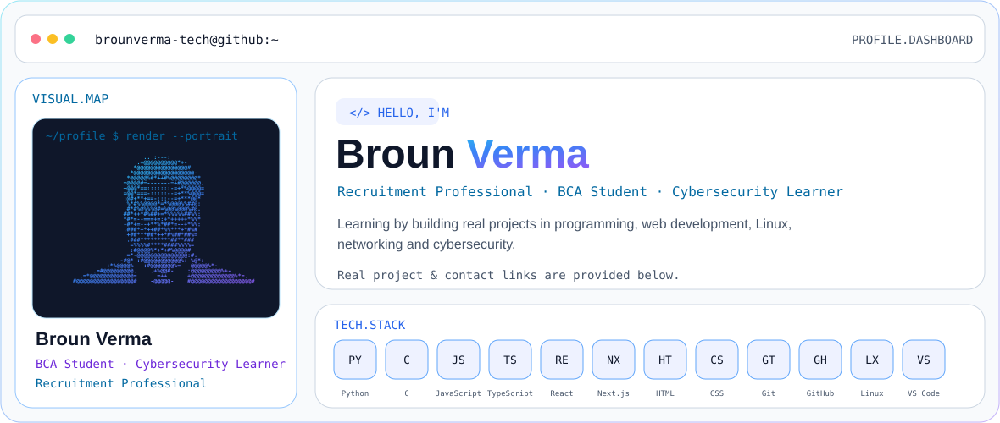

---

## 🚀 Featured Projects

| Project | Focus | Open |
|---|---|---|
| **KSA Learning Hub** | Learning-focused website project | [Open Repository](https://github.com/brounverma-tech/ksa-learning-hub) |
| **BrounStack** | Programming & learning platform | [Live Website](https://brounstack.in/) · [Repository](https://github.com/brounverma-tech/brounstack-website) |
| **Indelvia** | Professional business website | [Live Website](https://www.indelvia.com/) · [Repository](https://github.com/brounverma-tech/indelvia-website) |
| **School Management System** | School management web project | [Open Repository](https://github.com/brounverma-tech/school-management-system) |
| **Password Strength Checker** | Python security learning tool | [Open Repository](https://github.com/brounverma-tech/password-strength-checker) |
| **Network Port Scanner** | TCP port scanning project | [Open Repository](https://github.com/brounverma-tech/network-port-scanner) |

---

## 📦 All Repositories

### Web & Application

| Repository | Visibility |
|---|---|
| [**brounstack-website**](https://github.com/brounverma-tech/brounstack-website) | Private |
| [**indelvia-website**](https://github.com/brounverma-tech/indelvia-website) | Private |
| [**indelvia-website_new**](https://github.com/brounverma-tech/indelvia-website_new) | Private |
| [**ksa-learning-hub**](https://github.com/brounverma-tech/ksa-learning-hub) | Private |
| [**school-management-system**](https://github.com/brounverma-tech/school-management-system) | Private |
| [**website-learning-redesign**](https://github.com/brounverma-tech/website-learning-redesign) | Private |
| [**modern-calculator**](https://github.com/brounverma-tech/modern-calculator) | Public |
| [**brounverma-tech**](https://github.com/brounverma-tech/brounverma-tech) | Public |

### Cybersecurity & Python

| Repository | Visibility |
|---|---|
| [**password-strength-checker**](https://github.com/brounverma-tech/password-strength-checker) | Public |
| [**secure-password-generator**](https://github.com/brounverma-tech/secure-password-generator) | Public |
| [**file-integrity-checker**](https://github.com/brounverma-tech/file-integrity-checker) | Public |
| [**network-port-scanner**](https://github.com/brounverma-tech/network-port-scanner) | Public |
| [**log-file-analyzer**](https://github.com/brounverma-tech/log-file-analyzer) | Public |
| [**linux-security-audit-tool**](https://github.com/brounverma-tech/linux-security-audit-tool) | Public |

### C Programming

| Repository | Visibility |
|---|---|
| [**c-student-grade-calculator**](https://github.com/brounverma-tech/c-student-grade-calculator) | Public |
| [**c-number-guessing-game**](https://github.com/brounverma-tech/c-number-guessing-game) | Public |

### Books & Learning

| Repository | Visibility |
|---|---|
| [**web-technology-book**](https://github.com/brounverma-tech/web-technology-book) | Public |
| [**problem-solving-with-programming-book**](https://github.com/brounverma-tech/problem-solving-with-programming-book) | Public |
| [**mathematics-book**](https://github.com/brounverma-tech/mathematics-book) | Public |
| [**functional-english-1-book**](https://github.com/brounverma-tech/functional-english-1-book) | Public |

---

## 🧠 Tech Stack

---

## 📊 GitHub Activity

---

**Learning · Building · Improving · Securing**

