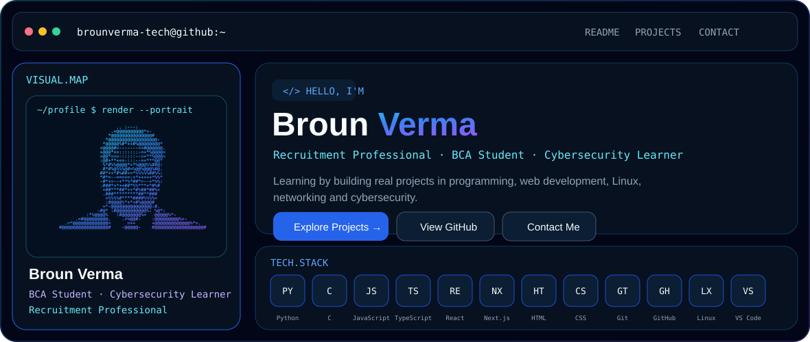
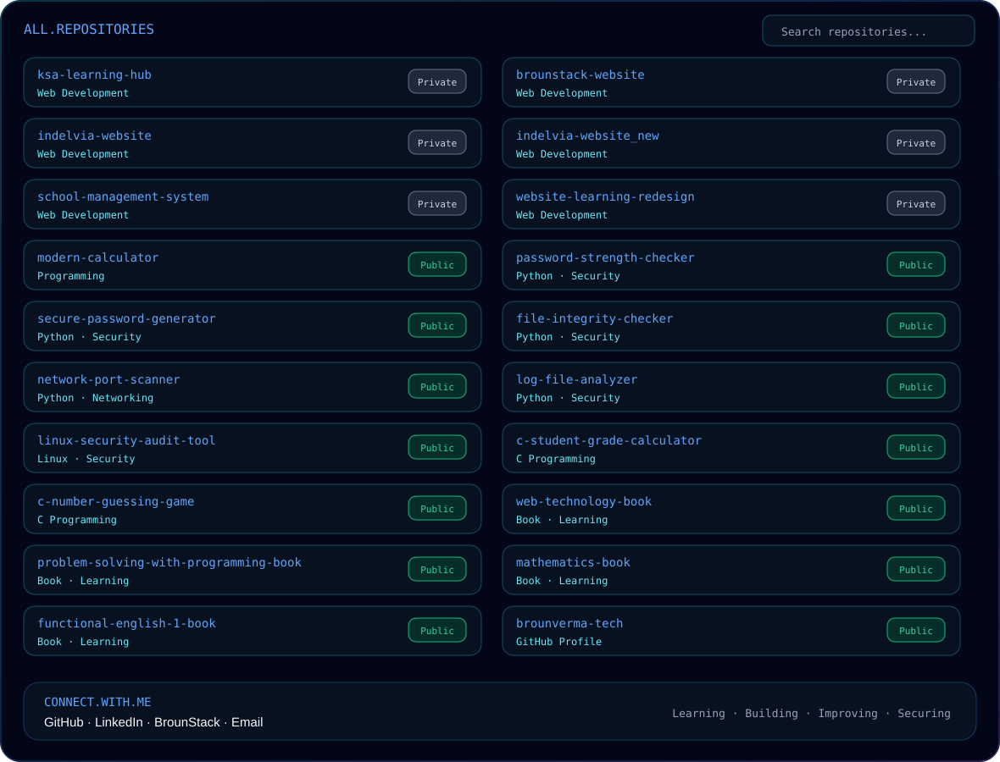

<picture>
  <source media="(prefers-color-scheme: dark)" srcset="./dashboard-hero-v3-dark.svg">
  <source media="(prefers-color-scheme: light)" srcset="./dashboard-hero-v3-light.svg">
  
</picture>

<picture>
  <source media="(prefers-color-scheme: dark)" srcset="./dashboard-projects-v3-dark.svg">
  <source media="(prefers-color-scheme: light)" srcset="./dashboard-projects-v3-light.svg">
  
</picture>

<picture>
  <source media="(prefers-color-scheme: dark)" srcset="./dashboard-repos-v3-dark.svg">
  <source media="(prefers-color-scheme: light)" srcset="./dashboard-repos-v3-light.svg">
  
</picture>

<b>Repository links</b>

### Web & Application
- [brounstack-website](https://github.com/brounverma-tech/brounstack-website)
- [indelvia-website](https://github.com/brounverma-tech/indelvia-website)
- [indelvia-website_new](https://github.com/brounverma-tech/indelvia-website_new)
- [ksa-learning-hub](https://github.com/brounverma-tech/ksa-learning-hub)
- [school-management-system](https://github.com/brounverma-tech/school-management-system)
- [website-learning-redesign](https://github.com/brounverma-tech/website-learning-redesign)
- [modern-calculator](https://github.com/brounverma-tech/modern-calculator)

### Cybersecurity & Python
- [password-strength-checker](https://github.com/brounverma-tech/password-strength-checker)
- [secure-password-generator](https://github.com/brounverma-tech/secure-password-generator)
- [file-integrity-checker](https://github.com/brounverma-tech/file-integrity-checker)
- [network-port-scanner](https://github.com/brounverma-tech/network-port-scanner)
- [log-file-analyzer](https://github.com/brounverma-tech/log-file-analyzer)
- [linux-security-audit-tool](https://github.com/brounverma-tech/linux-security-audit-tool)

### C Programming
- [c-student-grade-calculator](https://github.com/brounverma-tech/c-student-grade-calculator)
- [c-number-guessing-game](https://github.com/brounverma-tech/c-number-guessing-game)

### Books & Learning
- [web-technology-book](https://github.com/brounverma-tech/web-technology-book)
- [problem-solving-with-programming-book](https://github.com/brounverma-tech/problem-solving-with-programming-book)
- [mathematics-book](https://github.com/brounverma-tech/mathematics-book)
- [functional-english-1-book](https://github.com/brounverma-tech/functional-english-1-book)

